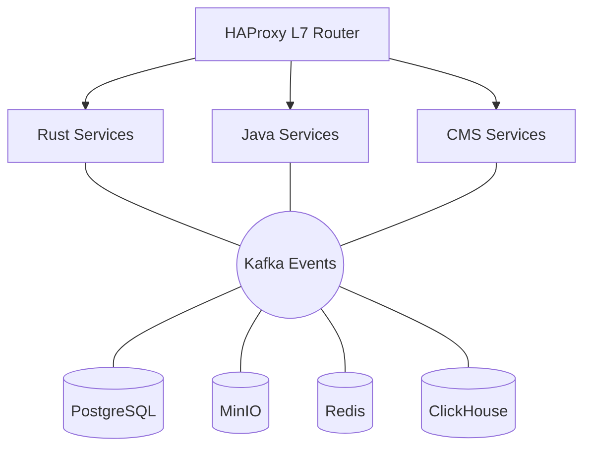

# 🏗️ Architecture Overview

[← Back to Documentation](./README.md)

---

## Introduction

This platform uses a **polyglot microservices architecture** where each service is built with the technology best suited for its responsibilities.

### Technology Stack

- **Rust** - Performance-critical I/O operations (20+ Gbps throughput)
- **Java/Spring Boot** - Complex business logic and orchestration
- **CMS/Laravel** - User-facing features, DRM, and content management
- **Kafka** - Event backbone for asynchronous communication

### Design Principles

1. **Separation of Concerns** - Each service has a single, well-defined responsibility
2. **Technology Fit** - Use the right tool for the right job
3. **Event-Driven** - Services communicate via events, not direct calls
4. **Scalability** - Each service scales independently
5. **Resilience** - Services fail gracefully with circuit breakers

---

## Architecture Diagram

**→ [View Complete Architecture Diagram](./ARCHITECTURE_DIAGRAM.md)** ← Detailed visual representation

### Simplified View

---

## Detailed Documentation

### Services

- **[Rust Services](./SERVICES_RUST.md)** - High-performance I/O layer
  - upload-service - Presigned URL generation
  - processing-worker - Video transcoding
  - streaming-service - Manifest generation

- **[Java Services](./SERVICES_JAVA.md)** - Business logic layer
  - video-service - Metadata management
  - job-service - Job orchestration
  - analytics-service - Metrics aggregation

- **[CMS Services](./SERVICES_CMS.md)** - User-facing layer
  - drm-service - License server (Widevine, PlayReady, FairPlay)
  - cms-service - Content management
  - portal-service - Public catalog

### Communication & Data

- **[Event Architecture](./EVENTS.md)** - Kafka topics and schemas
- **[Data Flows](./DATA_FLOWS.md)** - Upload, playback, moderation flows

### Infrastructure & Operations

- **[Infrastructure Components](./INFRASTRUCTURE.md)** - HAProxy, Nginx, databases
- **[Deployment Guide](./DEPLOYMENT.md)** - Dev, staging, production setup

---

## Quick Links

- [Getting Started](./README.md#-quick-start)
- [API Documentation](./README.md#-service-endpoints)
- [Performance Benchmarks](./README.md#-performance-targets)

---

[← Back to Documentation](./README.md)
