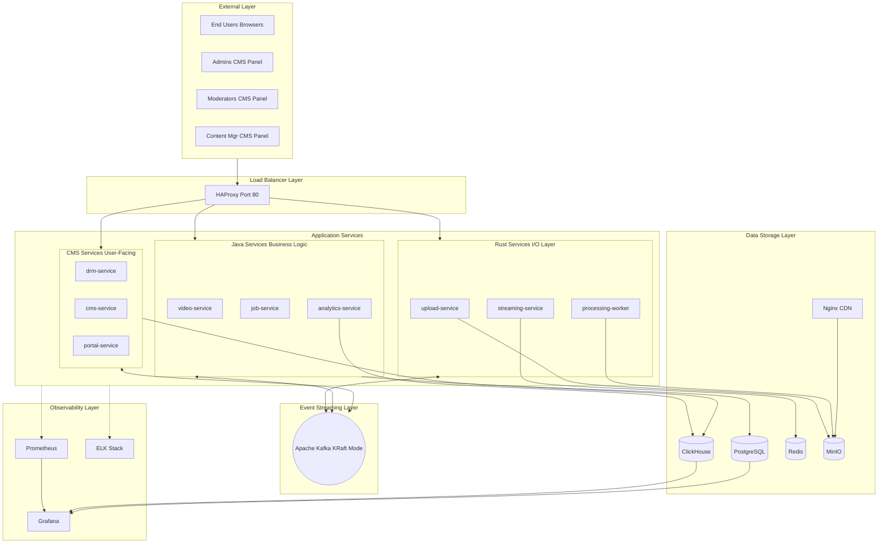
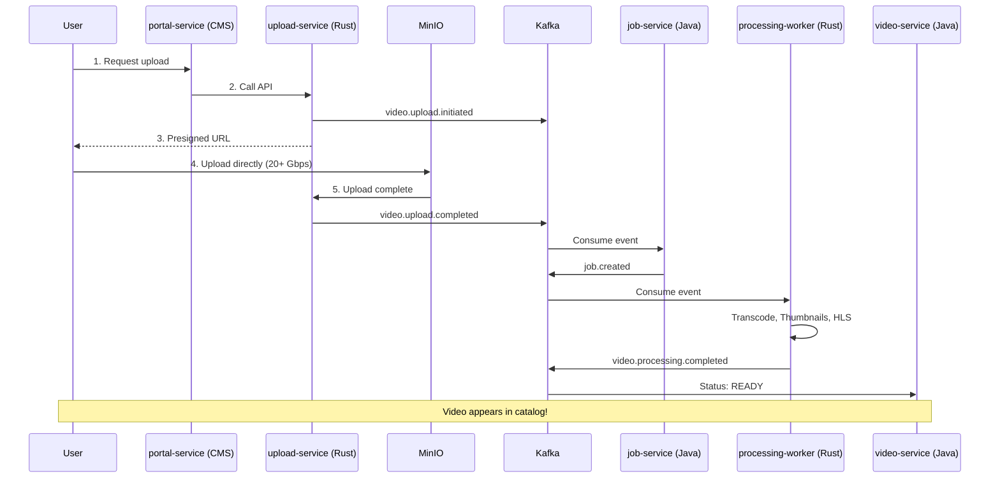
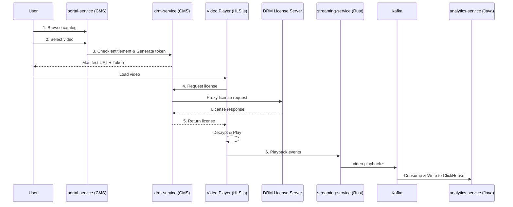
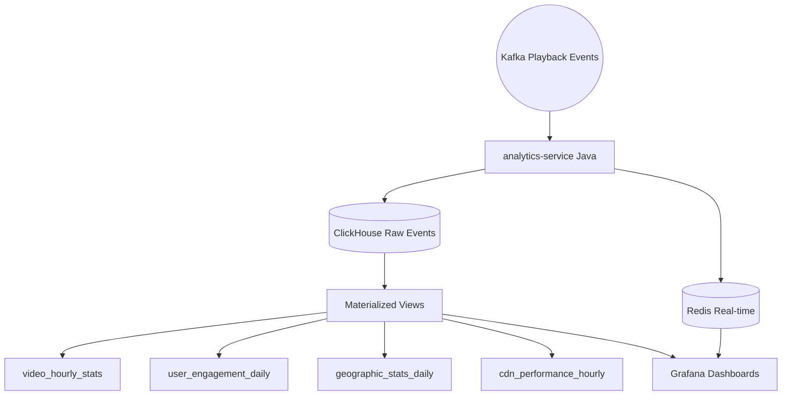

# 📐 Complete Architecture Diagram

[← Back to Architecture](./ARCHITECTURE.md)

---

## Full System Architecture

---

## Data Flow Diagrams

### 1. Video Upload Flow

---

### 2. Video Playback Flow (DRM)

---

### 3. Analytics Pipeline

---

## Technology Stack Summary

### Layer 1: Load Balancer

- **HAProxy** - 50k connections, SSL/TLS, health checks

### Layer 2: Application Services

**Rust (I/O Performance):**

- upload-service
- processing-worker
- streaming-service

**Java (Business Logic):**

- video-service
- job-service
- analytics-service

**CMS (User Interfaces):**

- drm-service
- cms-service
- portal-service

### Layer 3: Event Streaming

- **Kafka (KRaft mode)** - 40+ topics, 3+ brokers, no ZooKeeper

### Layer 4: Data Storage

**Operational Data:**

- **PostgreSQL** - Video metadata, jobs, users (Java services)
- **ClickHouse** - CMS data, permissions, analytics (CMS services)

**Analytics:**

- **ClickHouse** - Time-series analytics (90:1 compression)
- **Redis** - Real-time counters (< 1ms)

**Object Storage:**

- **MinIO** - Videos, thumbnails (20+ Gbps)

**CDN:**

- **Nginx** - Edge caching (50GB cache)

### Layer 5: Observability

- **Grafana** - Dashboards
- **Prometheus** - Metrics
- **ELK Stack** - Centralized logging

---

## Performance Metrics

| Component | Throughput | Latency | Scale |
| --------- | ---------- | ------- | ------ |
| **Upload** | 20+ Gbps | < 2ms | 10k+ concurrent |
| **Transcoding** | 100+ videos/hr | 1x realtime | Parallel workers |
| **Streaming** | 50+ Gbps | < 1ms | 10k+ viewers |
| **ClickHouse** | 1M+ rows/sec | < 100ms | Billions of rows |
| **Redis** | 100K+ ops/sec | < 1ms | TB memory |
| **PostgreSQL** | 10K+ TPS | < 50ms | Read replicas |
| **Kafka** | 1M+ msgs/sec | < 10ms | PB scale |

---

## Security Features

- ✅ DRM (Widevine, PlayReady, FairPlay)
- ✅ JWT authentication
- ✅ OAuth2 integration
- ✅ RBAC permissions
- ✅ Rate limiting
- ✅ Encryption at rest (AES-256)
- ✅ Encryption in transit (TLS 1.3)
- ✅ CORS configuration
- ✅ SQL injection prevention
- ✅ API key management

---

[← Back to Architecture](./ARCHITECTURE.md) | [Back to Docs Home →](./README.md)

## 📖 Related Documentation

### ⚙️ Service Documentation

- [🦀 Rust Services](./SERVICES_RUST.md) - High-performance I/O layer
- [☕ Java Services](./SERVICES_JAVA.md) - Business logic layer
- [🐘 CMS Services](./SERVICES_CMS.md) - User-facing layer

### Communication & Data

- [Event Architecture](./EVENTS.md) - Kafka topics and schemas
- [Data Flows](./DATA_FLOWS.md) - End-to-end workflows

### Operations

- [Infrastructure Components](./INFRASTRUCTURE.md) - HAProxy, Nginx, databases
- [Deployment Guide](./DEPLOYMENT.md) - Dev, staging, production setup
