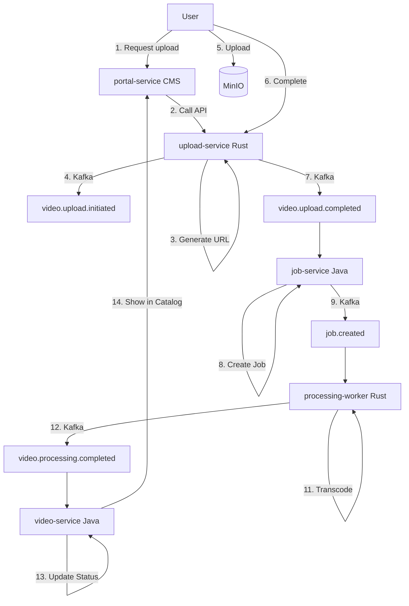
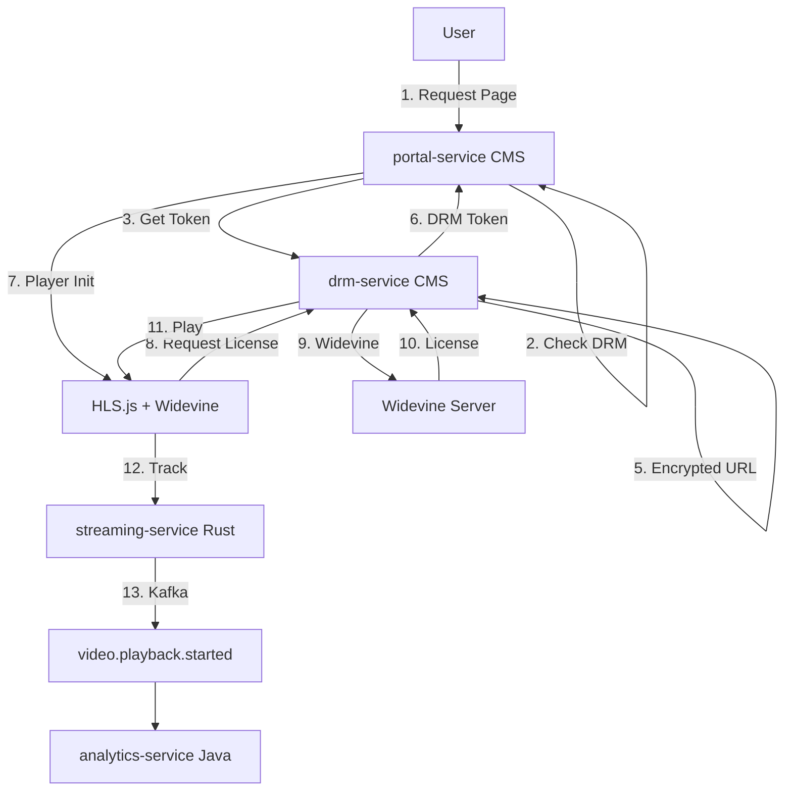
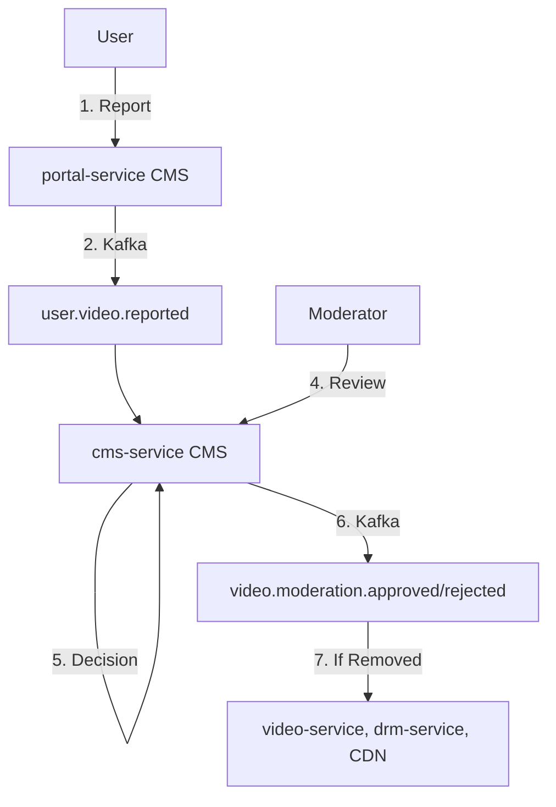
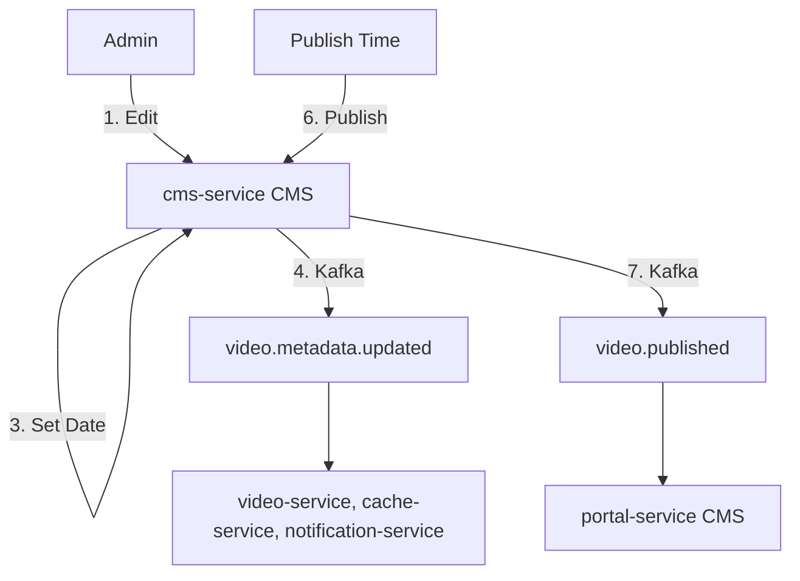
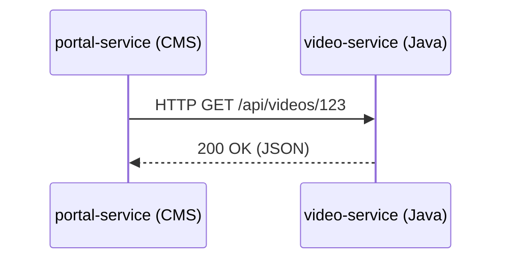
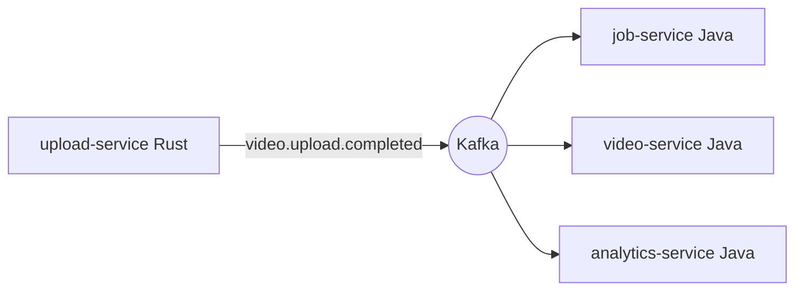

# 🔄 Data Flows

[← Back to Architecture](./ARCHITECTURE.md)

---

End-to-end data flows through the system for key use cases.

---

## Video Upload Flow

---

## Video Playback Flow (DRM-Protected)

---

## Content Moderation Flow

---

## Content Publishing Flow

---

## Service Communication Patterns

### Synchronous (REST APIs)

Used for request-response operations:

- User-facing APIs (portal → services)
- Admin operations (CMS → services)
- Health checks

**Example:**

### Asynchronous (Kafka Events)

Used for event notifications and background processing:

- Video lifecycle events
- Analytics tracking
- Job orchestration
- Audit logging

**Example:**

---

[← Events](./EVENTS.md) | [← Back to Architecture](./ARCHITECTURE.md) | [Next: Infrastructure →](./INFRASTRUCTURE.md)

## 📖 Related Documentation

### ⚙️ Service Documentation

- [🦀 Rust Services](./SERVICES_RUST.md) - High-performance I/O layer
- [☕ Java Services](./SERVICES_JAVA.md) - Business logic layer
- [🐘 CMS Services](./SERVICES_CMS.md) - User-facing layer

### Communication & Data

- [Event Architecture](./EVENTS.md) - Kafka topics and schemas
- [Data Flows](./DATA_FLOWS.md) - End-to-end workflows

### Operations

- [Infrastructure Components](./INFRASTRUCTURE.md) - HAProxy, Nginx, databases
- [Deployment Guide](./DEPLOYMENT.md) - Dev, staging, production setup
