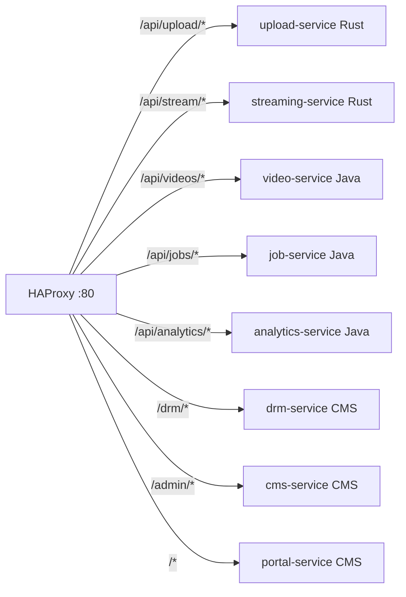

# 🏗️ Infrastructure Components

[← Back to Architecture](./ARCHITECTURE.md)

---

Core infrastructure components that support the platform.

---

## HAProxy (Load Balancer)

**Configuration:** `infrastructure/haproxy/haproxy.cfg`

### Routing Rules



### Features

- Round-robin load balancing
- Health checks (10s interval)
- Automatic failover
- SSL/TLS termination
- Stats page on :8404/stats
- 50k max connections
- CORS support

---

## Nginx (CDN Edge)

**Configuration:** `infrastructure/nginx/nginx.conf`

### Cache Strategy

- **Video segments (.ts, .m4s):** 365 days (immutable)
- **Manifests (.m3u8, .mpd):** 10 seconds (dynamic)
- **Thumbnails:** 1 day
- **Subtitles:** 1 day

### Performance

- 10k worker connections
- Sendfile enabled (zero-copy)
- Gzip compression for manifests
- HTTP/2 support
- 50GB cache size with LRU eviction

### Cache Path

```bash
/data/nginx/cache
  levels=1:2
  keys_zone=video_cache:100m
```

---

## PostgreSQL (Database)

**Configuration:** `infrastructure/postgres/init.sql`

### Tables

- `videos` - Video metadata
- `processing_jobs` - Job queue
- `video_variants` - Quality levels
- `analytics_events` - Partitioned by month
- `cdn_stats` - Edge metrics
- `worker_health` - Worker monitoring

### Postgres Features

- Read replicas for analytics
- Connection pooling (PgBouncer)
- Monthly partitioning for analytics
- Optimized indexes for common queries

### Users

- `cdn_app` - Read/write for services
- `cdn_readonly` - Read-only for monitoring

---

## MinIO (Object Storage)

### Buckets

- `videos/raw/` - Original uploads
- `videos/processed/` - Transcoded variants
- `videos/thumbnails/` - Generated thumbnails
- `videos/subtitles/` - Caption files

### MinIO Features

- S3-compatible API
- Presigned URLs for uploads
- Lifecycle policies for cleanup
- Versioning enabled
- Multi-region replication (production)

### MinIO Performance

- 20+ Gbps throughput
- Distributed mode (4+ nodes in production)
- Erasure coding for durability

---

## Redis (Cache & Sessions)

### Use Cases

- API response caching
- Session storage
- Rate limiting
- DRM token cache
- Leaderboards (video popularity)
- Viewer session tracking

### Redis Configuration

- Eviction policy: LRU (Least Recently Used)
- Max memory: 4GB
- Persistence: RDB snapshots
- High availability: Redis Sentinel (production)

---

## Kafka (Event Broker)

### Deployment

- 3+ brokers for HA
- **KRaft mode** (no ZooKeeper dependency)
- Replication factor: 3
- Min in-sync replicas: 2

### Topics

- 40+ topics for different event types
- Partitioned by `videoId` for ordering
- 10 partitions per topic

### Retention

- Default: 7 days
- Analytics: 30 days
- Audit: 90 days

---

## ClickHouse (Analytics Database)

**Purpose:** High-performance analytics and time-series data

### ClickHouse Use Cases

- Video playback analytics
- User engagement metrics
- Geographic distribution analysis
- CDN performance tracking
- Revenue analytics
- Real-time dashboards

### Key Features

- **Columnar storage** - 90:1 compression ratio
- **Materialized views** - Real-time aggregation
- **Vectorized execution** - 10-100x faster queries
- **SQL support** - Standard SQL syntax
- **Partitioning** - Automatic data management
- **TTL** - Automatic data cleanup

### Tables & Materialized Views

```sql
-- Raw events
video_playback_events (90-day retention)

-- Materialized views (auto-updating)
├── video_hourly_stats
├── user_engagement_daily
├── geographic_stats_daily
└── cdn_performance_hourly
```

### CH Performance

- Write: 1M+ rows/sec
- Query: < 100ms for complex aggregations
- Storage: 90:1 compression (1TB → 12GB)
- Memory: 3-4GB for billions of rows

### Configuration

```yaml
clickhouse:
  ports:
    - 8123:8123  # HTTP
    - 9000:9000  # Native
  settings:
    - max_memory_usage: 8GB
    - max_threads: 8
```

---

[← Data Flows](./DATA_FLOWS.md) | [← Back to Architecture](./ARCHITECTURE.md) | [Next: Deployment →](./DEPLOYMENT.md)

## 📖 Related Documentation

### ⚙️ Service Documentation

- [🦀 Rust Services](./SERVICES_RUST.md) - High-performance I/O layer
- [☕ Java Services](./SERVICES_JAVA.md) - Business logic layer
- [🐘 CMS Services](./SERVICES_CMS.md) - User-facing layer

### 📡 Communication & Data

- [📡 Event Architecture](./EVENTS.md) - Kafka topics and schemas
- [🔄 Data Flows](./DATA_FLOWS.md) - End-to-end workflows

### 🚀 Operations

- [🏗️ Infrastructure Components](./INFRASTRUCTURE.md) - HAProxy, Nginx, databases
- [🚀 Deployment Guide](./DEPLOYMENT.md) - Dev, staging, production setup
