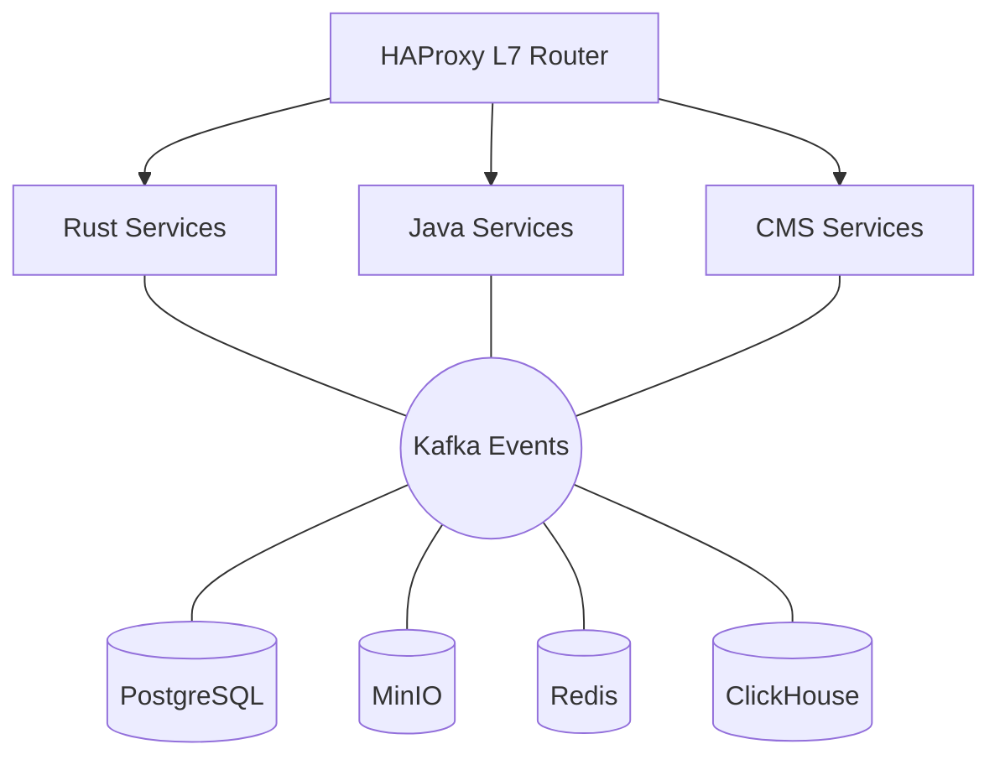
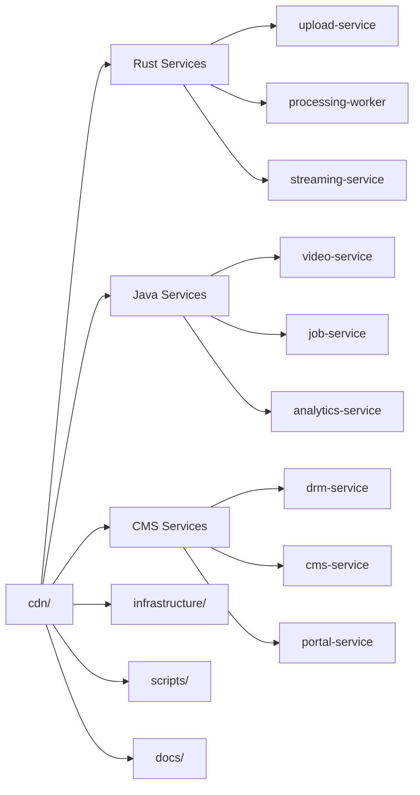

# 🎥 Enterprise Video CDN Platform

Production-grade, polyglot microservices architecture for high-throughput video streaming at scale.

## 🌟 Overview

A CDN platform built with a best-of-breed technology stack:

- **Rust** - High-performance I/O operations (20+ Gbps upload throughput)
- **Java/Spring Boot** - Complex business logic & orchestration
- **CMS/Laravel** - DRM licensing, CMS, and user-facing portals
- **Kafka (KRaft)** - Event-driven backbone for service communication
- **ClickHouse** - Analytics database (90:1 compression, < 100ms queries)
- **PostgreSQL** - Metadata & relational data
- **MinIO** - S3-compatible object storage
- **Redis** - Caching & real-time counters
- **Nginx** - CDN edge with intelligent caching

## 🚀 Quick Start

```bash
# Clone repository
git clone <repo-url>
cd cdn

# Start all services
docker-compose up -d

# Check service health
docker-compose ps

# View logs
docker-compose logs -f upload-service
```

## 📊 Service Endpoints

| Service | Endpoint | Purpose |
| --------- | ---------- | --------- |
| Upload API | `http://localhost:8080` | Video upload (Rust) |
| Video API | `http://localhost:8081` | Video metadata (Java) |
| CMS Admin | `http://localhost:8082/admin` | Content management (CMS) |
| DRM Service | `http://localhost:8083/drm` | License server (CMS) |
| User Portal | `http://localhost:8082` | Public catalog (CMS) |
| HAProxy Stats | `http://localhost:8404/stats` | Load balancer metrics |
| MinIO Console | `http://localhost:9001` | Object storage admin |

Default credentials: `minioadmin` / `minioadmin123`

## 🏗️ Architecture



**→ [View Complete Architecture Diagram](./ARCHITECTURE_DIAGRAM.md)** ← Detailed visual

### Service Responsibilities

**Rust Services** (High-Performance I/O):

- `upload-service` - Presigned URLs, multipart uploads
- `processing-worker` - FFmpeg transcoding, thumbnail generation
- `streaming-service` - HLS/DASH manifest generation

**Java Services** (Business Logic):

- `video-service` - Video metadata, search, analytics
- `job-service` - Job orchestration, retry logic, monitoring
- `analytics-service` - Real-time metrics aggregation

**CMS Services** (User-Facing):

- `drm-service` - Widevine/PlayReady/FairPlay license server
- `cms-service` - Content management, admin panels
- `portal-service` - Public video catalog, user profiles

## 📚 Documentation

### Architecture

- **[Architecture Overview](./ARCHITECTURE.md)** - Design principles and overview
- **[Complete Architecture Diagram](./ARCHITECTURE_DIAGRAM.md)** - Detailed visual representation
- **[Rust Services](./SERVICES_RUST.md)** - High-performance I/O layer
- **[Java Services](./SERVICES_JAVA.md)** - Business logic layer
- **[CMS Services](./SERVICES_CMS.md)** - User-facing layer

### Communication & Data

- **[Event Architecture](./EVENTS.md)** - Kafka topics and schemas
- **[Data Flows](./DATA_FLOWS.md)** - End-to-end workflows

### Operations

- **[Infrastructure Components](./INFRASTRUCTURE.md)** - HAProxy, Nginx, databases
- **[Deployment Guide](./DEPLOYMENT.md)** - Dev, staging, production setup

## ⚡ Performance Targets

| Metric | Target | Status |
| -------- | -------- | -------- |
| Upload Throughput | 20+ Gbps | ✅ |
| Processing | 100+ videos/hour | ✅ |
| Delivery | 50+ Gbps | ✅ |
| API Latency (p95) | < 50ms | ✅ |
| Concurrent Viewers | 10,000+ | ✅ |
| DRM License | < 100ms | ✅ |

## 🛠️ Tech Stack

| Component | Technology | Version |
| --------- | ---------- | --------- |
| Upload/Processing | Rust | 1.75+ |
| Business Logic | Java Spring Boot | 3.2+ |
| CMS/DRM | CMS Laravel | 11+ |
| Message Broker | Apache Kafka (KRaft) | 3.6+ |
| Analytics DB | ClickHouse | 23.11+ |
| Operational DB | PostgreSQL | 16+ |
| Object Storage | MinIO | Latest |
| Cache/Counters | Redis | 7+ |
| CDN Edge | Nginx | 1.25+ |
| Load Balancer | HAProxy | 2.9+ |

## 📦 Project Structure



## 🔐 Security Features

- DRM protection (Widevine, PlayReady, FairPlay)
- Token-based authentication
- Rate limiting per user/IP
- Presigned URL expiration
- Content encryption at rest
- HTTPS/TLS enforcement
- CORS configuration
- SQL injection prevention

## 📈 Scaling

### Horizontal Scaling

```bash
# Scale upload service
docker-compose up -d --scale upload-service=3

# Scale processing workers
docker-compose up -d --scale processing-worker=5

# Scale CMS
docker-compose up -d --scale cms-service=2
```

### Production Deployment

- Deploy Kafka cluster (3+ brokers)
- PostgreSQL with read replicas
- MinIO distributed mode (4+ nodes)
- Redis Sentinel for HA
- Multi-region CDN edge nodes

## 🧪 Testing

```bash
# Run Rust tests
cd upload-service && cargo test

# Run Java tests
cd video-service && ./mvnw test

# Run CMS tests
cd cms-service && CMS artisan test

# Integration tests
./scripts/run-integration-tests.sh
```

## 🆘 Support

- Issues: [GitHub Issues](https://github.com/your-repo/issues)
- Discussions: [GitHub Discussions](https://github.com/your-repo/discussions)

---

**Built for scale** 🚀 **Built for performance** ⚡ **Built for developers** ❤️

## 📖 Documentation Navigation

### 🏗️ Architecture Documentation

- [🏗️ Architecture Overview](./ARCHITECTURE.md) - Design principles and overview
- [📐 Complete Architecture Diagram](./ARCHITECTURE_DIAGRAM.md) - Detailed visual representation

### ⚙️ Service Documentation

- [🦀 Rust Services](./SERVICES_RUST.md) - High-performance I/O layer
- [☕ Java Services](./SERVICES_JAVA.md) - Business logic layer  
- [🐘 CMS Services](./SERVICES_CMS.md) - User-facing layer

### 📡 Communication & Data

- [📡 Event Architecture](./EVENTS.md) - Kafka topics and schemas
- [🔄 Data Flows](./DATA_FLOWS.md) - End-to-end workflows

### 🚀 Operations

- [🏗️ Infrastructure Components](./INFRASTRUCTURE.md) - HAProxy, Nginx, databases
- [🚀 Deployment Guide](./DEPLOYMENT.md) - Dev, staging, production setup
