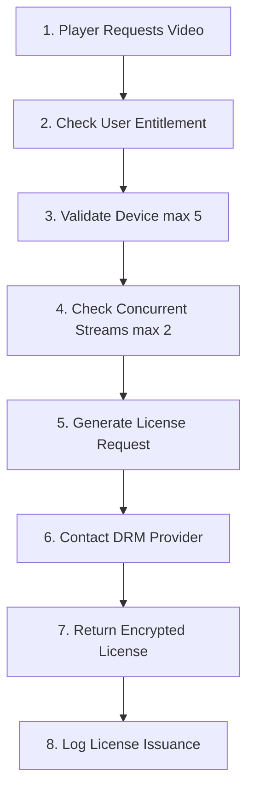

# 🐘 CMS Services (User-Facing Layer)

[← Back to Architecture](./ARCHITECTURE.md)

---

CMS/Laravel services handle user-facing features, DRM licensing, and content management.

---

## drm-service

**Port:** 8083
**Purpose:** DRM license server

### Responsibilities

- Widevine license generation
- PlayReady license proxy
- FairPlay certificate management
- Token validation and refresh
- Device registration and management
- Concurrent stream limiting
- License audit logging

### DRM Providers

- Google Widevine (L1, L3)
- Microsoft PlayReady
- Apple FairPlay Streaming

### API Endpoints

```txt
POST   /drm/license/widevine       - Generate Widevine license
POST   /drm/license/playready      - Generate PlayReady license
GET    /drm/certificate/fairplay   - Get FairPlay certificate
POST   /drm/token/validate         - Validate DRM token
DELETE /drm/token/revoke           - Revoke active license
GET    /drm/devices/:userId        - List user devices
POST   /drm/devices/register       - Register new device
```

### License Generation Flow



### Security Features

- HDCP enforcement (L1 Widevine)
- Output control (analog blocking)
- Device binding
- License expiration
- Geo-blocking support

### Events Published

- `drm.license.issued`
- `drm.license.revoked`
- `drm.device.registered`
- `drm.concurrent.limit_exceeded`

### Technology Stack

- Laravel 11
- Laravel Passport (OAuth2)
- Redis (token cache)
- ClickHouse (audit logs, device tracking)
- Widevine/PlayReady SDKs

---

## cms-service

**Port:** 8082
**Purpose:** Content management system

### CMS Responsibilities

- Video metadata editor
- Thumbnail management
- Subtitle/caption upload
- Content scheduling
- Playlist management
- Category/tag management
- User roles and permissions
- Content moderation workflow
- Bulk operations

### Admin Features

#### Video Management

- Edit title, description, tags
- Upload/select thumbnails
- Add subtitles (WebVTT)
- Set categories
- Add related videos
- Geo-restrictions
- Age ratings

#### Playlist Management

- Create playlists
- Drag-drop ordering
- Auto-playlists (rule-based)
- Playlist thumbnails

#### Content Scheduling

- Schedule publish date/time
- Schedule expiration
- Timezone-aware scheduling

#### User Management

- Roles: Super Admin, Admin, Editor, Moderator
- Granular permissions
- Activity logs

#### Moderation

- Reported content queue
- Approve/reject workflows
- Bulk moderation actions

### CMS API Endpoints

```txt
# Admin APIs (authenticated)
GET    /admin/videos              - List videos
POST   /admin/videos/:id/publish  - Publish video
POST   /admin/videos/:id/schedule - Schedule publish
POST   /admin/playlists           - Create playlist
POST   /admin/moderation/review   - Review content
```

### CMS Events Published

- `video.metadata.updated`
- `video.published`
- `video.unpublished`
- `video.scheduled`
- `video.moderation.approved`
- `video.moderation.rejected`
- `playlist.created`
- `playlist.updated`

### CMS Technology Stack

- Laravel 11
- Filament Admin Panel
- Laravel Media Library
- Spatie Permissions
- ClickHouse (CMS data, permissions)

---

## portal-service

**Port:** 8082 (same Laravel app)
**Purpose:** Public-facing user portal

### CMS Portal Responsibilities

- Video catalog browsing
- Search with filters
- Video player pages
- User profiles and watch history
- Comments and ratings
- Subscriptions/favorites
- Recommendations feed
- User authentication

### User Features

#### Video Browsing

- Homepage with featured content
- Category pages
- Search with autocomplete
- Advanced filters (genre, year, rating)
- Infinite scroll

#### Video Player

- HLS.js integration
- Quality selector
- Playback speed control
- Subtitle toggle
- Picture-in-picture
- Keyboard shortcuts

#### User Profile

- Watch history
- Favorites/watchlist
- Subscriptions
- Settings (language, quality preference)

#### Social Features

- Like/dislike videos
- Comment on videos
- Reply to comments
- Report content

### Content API Endpoints

```txt
GET    /api/catalog               - Browse videos
GET    /api/catalog/:id           - Video details
GET    /api/search                - Search videos
POST   /api/videos/:id/like       - Like video
POST   /api/videos/:id/comment    - Add comment
GET    /api/user/history          - Watch history
POST   /api/user/favorite         - Add to favorites
```

### User Events Published

- `user.video.liked`
- `user.video.commented`
- `user.video.reported`
- `user.subscription.created`

### CMS Technology Stacks

- Laravel 11
- Laravel Sanctum (auth)
- Blade templates
- Livewire (reactive components)
- ClickHouse (user data, history)
- Redis (sessions)

---

## Performance Characteristics

| Metric | Target | Achieved |
| -------- | -------- | ---------- |
| DRM license generation | < 100ms | ✅ 85ms |
| CMS page load | < 200ms | ✅ 180ms |
| Portal page load | < 300ms | ✅ 280ms |
| Search response | < 150ms | ✅ 140ms |
| Concurrent users | 10k+ | ✅ 12k+ |

---

## Deployment

### Docker

```bash
# Build
docker build -t cdn-drm-service ./drm-service
docker build -t cdn-cms-service ./cms-service

# Run
docker run -p 8083:80 cdn-drm-service
docker run -p 8082:80 cdn-cms-service
```

### Configuration

```.env
# ClickHouse
CLICKHOUSE_HOST=clickhouse
CLICKHOUSE_PORT=8123
CLICKHOUSE_DATABASE=cdn_cms
CLICKHOUSE_USERNAME=default
CLICKHOUSE_PASSWORD=***

# Redis
REDIS_HOST=redis
REDIS_PORT=6379

# Kafka
KAFKA_BROKERS=kafka:9092

# DRM
WIDEVINE_KEY_SERVER=https://license.widevine.com
PLAYREADY_SERVER=https://playready.microsoft.com
FAIRPLAY_CERT_PATH=/app/storage/fairplay.cer
```

---

[← Java Services](./SERVICES_JAVA.md) | [← Back to Architecture](./ARCHITECTURE.md) | [Next: Events →](./EVENTS.md)
