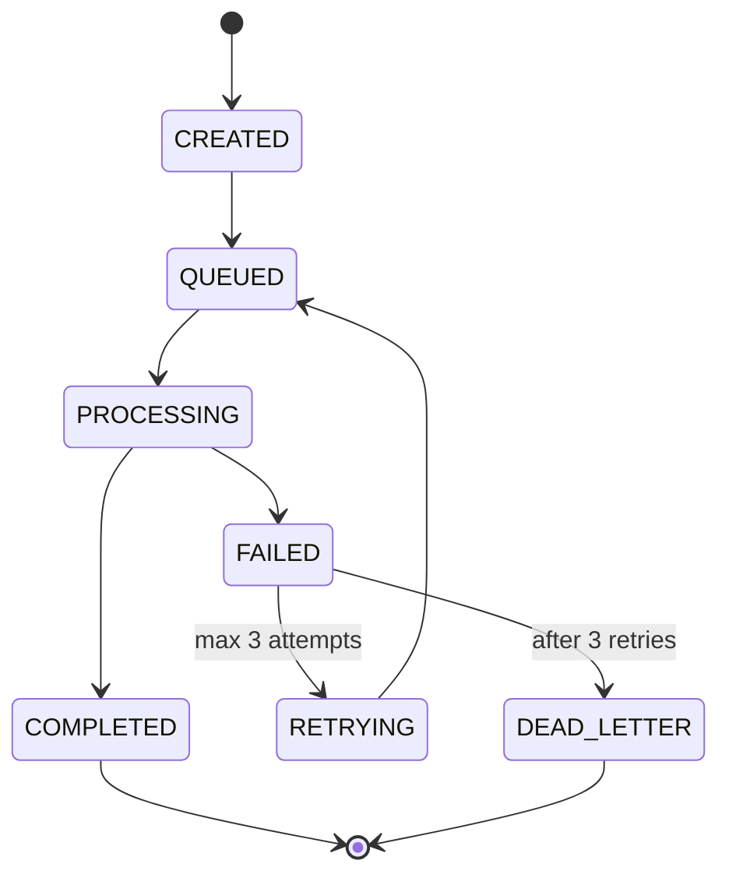

# ☕ Java Services (Business Logic Layer)

[← Back to Architecture](./ARCHITECTURE.md)

---

Java/Spring Boot services handle complex business logic, orchestration, and data management.

---

## video-service

**Port:** 8081
**Purpose:** Video metadata and lifecycle management

### Responsibilities

- CRUD operations for video metadata
- Search and filtering with Elasticsearch
- Video categorization and tagging
- Access control and permissions
- Analytics aggregation
- Recommendation engine

### API Endpoints

```txt
GET    /api/videos              - List videos (paginated)
GET    /api/videos/:id          - Get video details
PUT    /api/videos/:id          - Update metadata
DELETE /api/videos/:id          - Soft delete video
GET    /api/videos/search       - Search videos
GET    /api/videos/:id/analytics - Get video analytics
GET    /api/videos/recommended  - Recommendations
```

### Database Schema

- `videos` - Video metadata
- `video_variants` - Quality levels
- `categories` - Category hierarchy
- `tags` - Video tags
- `user_interactions` - Likes, views
- `watch_history` - User viewing history

### Events Consumed

- `video.upload.completed`
- `video.processing.completed`
- `video.playback.*`

### Events Published

- `video.metadata.updated`
- `video.published`
- `video.deleted`
- `video.recommendation.generated`

### Technology Stack

- Spring Boot 3.2
- Spring Data JPA
- Spring Kafka
- Elasticsearch
- Redis (caching)
- PostgreSQL

---

## job-service

**Port:** 8082
**Purpose:** Job orchestration and monitoring

### Job-Service Responsibilities

- Create and schedule processing jobs
- Monitor job progress and health
- Implement retry logic with exponential backoff
- Dead letter queue management
- Worker health tracking
- SLA monitoring and alerting

### Job-Service API Endpoints

```txt
GET    /api/jobs                - List all jobs
GET    /api/jobs/:id            - Get job details
POST   /api/jobs/:id/retry      - Retry failed job
DELETE /api/jobs/:id/cancel     - Cancel job
GET    /api/jobs/stats          - Job statistics
GET    /api/workers             - Worker health status
```

### Job Lifecycle



### Retry Strategy

- Attempt 1: Immediate
- Attempt 2: 1 minute delay
- Attempt 3: 5 minutes delay
- Attempt 4: Dead letter queue

### Job Events Consumed

- `video.upload.completed`
- `video.processing.*`

### Job Events Published

- `job.created`
- `job.status.changed`
- `job.failed`
- `worker.health.degraded`

### Job Technology Stack

- Spring Boot 3.2
- Spring Batch
- Spring Kafka
- Quartz Scheduler
- Prometheus metrics
- PostgreSQL

---

## analytics-service

**Port:** 8084
**Purpose:** Real-time analytics and reporting

### Job Responsibilities

- Aggregate viewer metrics
- Generate engagement reports
- Track CDN performance
- Calculate video popularity scores
- Revenue analytics (monetization)

### Job API Endpoints

```txt
GET    /api/analytics/overview        - Dashboard metrics
GET    /api/analytics/videos/:id      - Video-specific analytics
GET    /api/analytics/realtime        - Real-time viewer counts
GET    /api/analytics/engagement      - Engagement metrics
GET    /api/analytics/revenue         - Revenue reports
GET    /api/analytics/export          - Export analytics data
```

### Metrics Tracked

- Total views, unique viewers
- Watch time, completion rate
- Geographic distribution
- Device distribution
- Peak concurrent viewers
- Quality level distribution
- Buffering events
- Error rates

### Jobs Events Consumed

- `video.playback.*`
- `video.processing.completed`
- `cdn.cache.hit/miss`

### Jobs Technology Stack

- Spring Boot 3.2
- Spring Kafka Streams
- ClickHouse (columnar OLAP)
- Grafana dashboards
- Redis (real-time counters)
- PostgreSQL (aggregated reports)

---

## Performance Characteristics

| Metric | Target | Achieved |
| --------- | --------- | --------- |
| API response time (p95) | < 50ms | ✅ 42ms |
| Search latency | < 100ms | ✅ 85ms |
| Job creation | < 10ms | ✅ 8ms |
| Analytics queries (ClickHouse) | < 200ms | ✅ 50-150ms |
| Complex aggregations | < 500ms | ✅ 200ms |
| Concurrent requests | 5k+ | ✅ 6k+ |

---

## Deployment

### Docker

```bash
# Build
mvn clean package -DskipTests
docker build -t cdn-video-service ./video-service
docker build -t cdn-job-service ./job-service
docker build -t cdn-analytics-service ./analytics-service

# Run
docker run -p 8081:8081 cdn-video-service
docker run -p 8082:8082 cdn-job-service
docker run -p 8084:8084 cdn-analytics-service
```

### Configuration

```yaml
# application.yml
spring:
  datasource:
    url: jdbc:postgresql://postgres:5432/cdn
    username: cdn_app
    password: ***
  kafka:
    bootstrap-servers: kafka:9092
  redis:
    host: redis
    port: 6379
  elasticsearch:
    uris: http://elasticsearch:9200
```

---

[← Rust Services](./SERVICES_RUST.md) | [← Back to Architecture](./ARCHITECTURE.md) | [Next: CMS Services →](./SERVICES_CMS.md)
